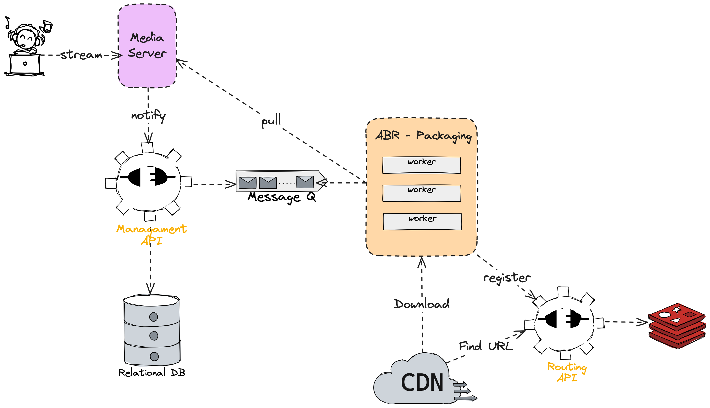

# Dionysia

> A streaming platform based on open source software

If you are interested on reading my ideas and thoughts about this project, you can read the [dev log](docs/DEV_LOG.md)

## What is this?

This project is a streaming platform based on open source software. The main goal is to create a platform that can be used by anyone to stream their content, be it a game, a podcast, a talk show, etc.

It plugs many open source projects together to create a seamless experience for video developers.

## What does it do?

The platform can be used stream content to a server, which will then distribute it to viewers.

## How does it work?

The platform is composed of several components:



* **Media Server**: The server that will receive the stream that will be pulled by a worker.
* **Management API**: An API used to manage streams, check status, watch metrics, etc.
* **Worker**: A worker that will pull the stream from the media server, encode and transcode the video to enable playback on various devices and under different network conditions, and distribute it to viewers through a CDN.
* **Routing API**: An API used to route CDN requests to the right origins.
* **CDN**: A CDN used to distribute the stream to viewers.

## Tech Stack

The platform is built using the following technologies:

* [Go](https://go.dev/) for all the services and workers
* [mediamtx](https://github.com/bluenviron/mediamtx) for the media server
* [gpac](https://gpac.io/) for the encoding, transcoding, and packaging
* [asynq](https://github.com/hibiken/asynq) for distributing tasks to workers

## Development

### Running

All tasks are managed by a Justfile. You can see all the available tasks by running:

```sh
just -l
```

To run the platform, you need to have Docker and docker compose installed. Then, you can run the following command:

```sh
docker compose up
```

### Code Quality

To run the test suite:

```sh
just test
```

To run code linting:

```sh
just lint
```

## Contributing

Feel free to contribute to this project by opening issues or pull requests.

## Roadmap

- [ ] Video and audio transcoding (profiles)
- [ ] Ingest authentication
- [ ] Playback authentication
- [ ] API authentication

## Why the name?

> Dionysia is a festival in ancient Greece in honor of Dionysus, the god of wine, fertility, and theater. It was a time of celebration, where people would gather to watch plays, dance, and drink wine.

Thank you @josethz00 for the name suggestion!
